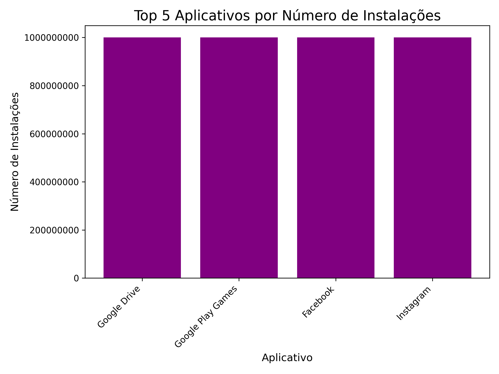
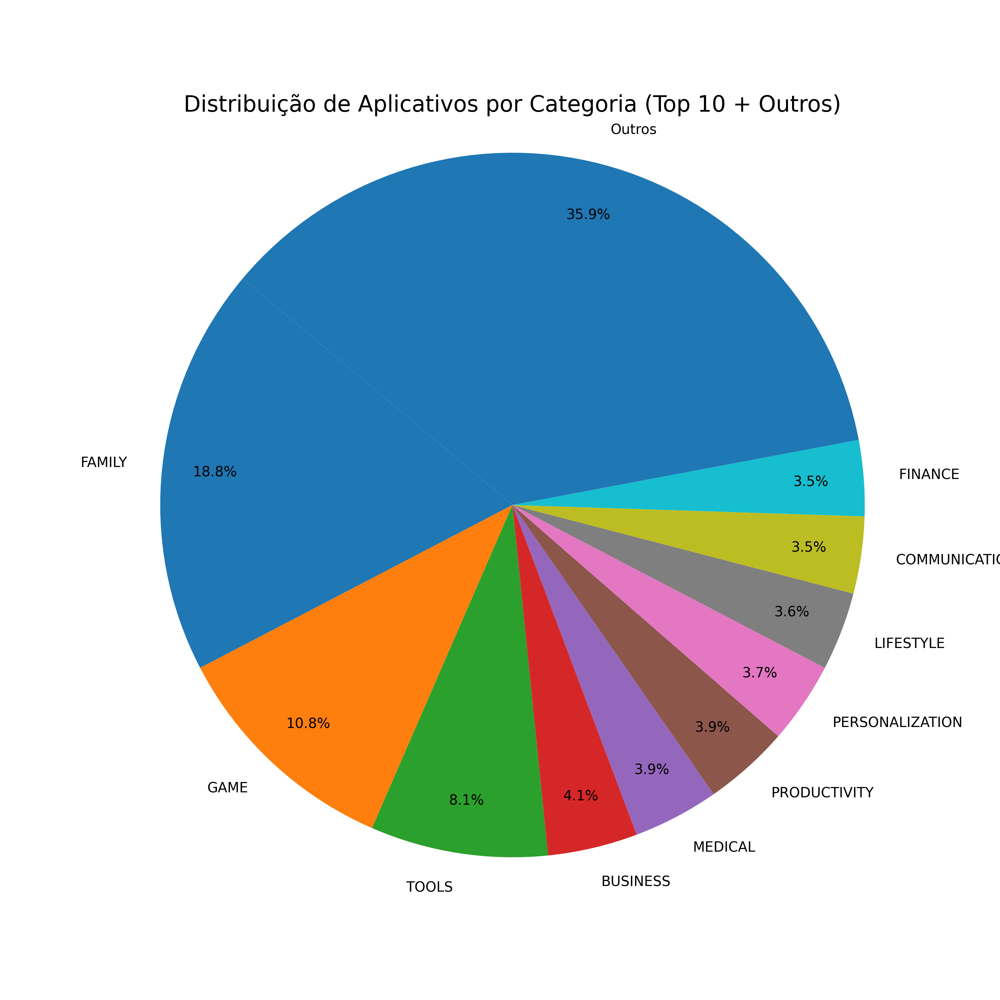
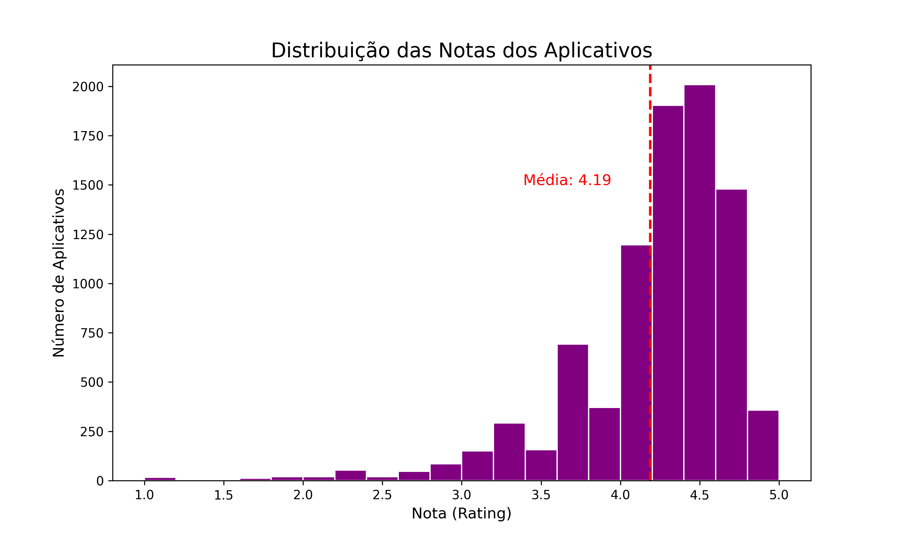
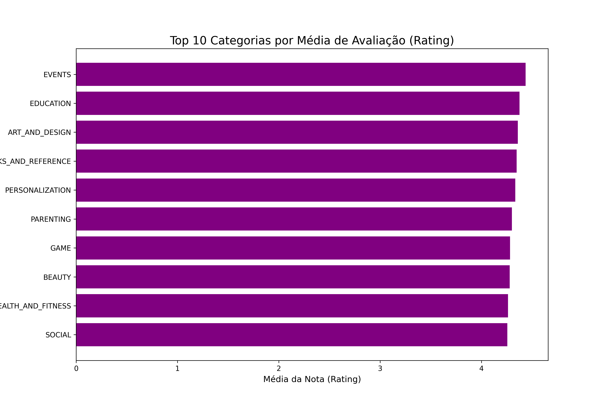

# Desafio de Análise de Dados - Google Play Store


Análise exploratória do dataset `googleplaystore.csv` para extrair insights sobre o mercado de aplicativos, como parte de um desafio de bolsa de estudos.

## 📊 Sobre o Projeto

Este projeto consiste em uma análise de dados completa sobre o dataset da Google Play Store. O objetivo principal foi praticar e demonstrar habilidades em Python para análise de dados, utilizando um fluxo de trabalho que abrange desde a limpeza e pré-processamento dos dados até a geração de visualizações gráficas para comunicar os resultados encontrados.

O notebook (`desafio.ipynb`) documenta cada passo do processo, explicando a lógica por trás de cada decisão de análise e limpeza.

## 🚀 Principais Análises Realizadas

O projeto respondeu a uma série de perguntas sobre o dataset, gerando os seguintes indicadores e visualizações:

* **Top 5 Apps por Instalação:** Identificação dos aplicativos com maior número de instalações.
* **Distribuição de Categorias:** Análise da participação de mercado das categorias de aplicativos.
* **Identificação do App Mais Caro:** Encontrado o aplicativo com o maior preço na loja.
* **Contagem por Classificação Etária:** Quantificação de aplicativos com a classificação "Mature 17+".
* **Top 10 Apps por Reviews:** Ranking dos aplicativos com maior número de avaliações.
* **Distribuição das Notas (Ratings):** Análise da frequência das notas atribuídas aos apps.
* **Top Categorias por Média de Nota:** Ranking das categorias com as melhores avaliações médias.

## 📈 Resultados Visuais

Abaixo estão alguns dos principais resultados e visualizações gerados durante a análise.

#### Top 5 Aplicativos por Número de Instalações
*O gráfico de barras mostra os gigantes da Play Store, com aplicativos como Google Play Games e Facebook liderando em número de downloads.*



---

#### Distribuição de Categorias de Aplicativos
*O gráfico de pizza/donut revela que as categorias "Family" e "Game" dominam o ecossistema, seguidas por "Tools".*



---

#### Distribuição das Notas (Ratings) dos Apps
*O histograma mostra uma forte concentração de aplicativos com notas altas, com um pico significativo acima de 4.0. A linha vermelha indica a média geral de nota na loja.*



---

#### Top 10 Categorias por Média de Nota
*O gráfico de barras horizontais destaca as categorias de nicho, como "Events" e "Education", que possuem as maiores médias de avaliação, indicando alta satisfação do usuário.*




---

## 🛠️ Tecnologias Utilizadas

As seguintes ferramentas e bibliotecas foram essenciais para a realização deste projeto:

* [**Python**](https://www.python.org/): A linguagem de programação base para toda a análise.
* [**Pandas**](https://pandas.pydata.org/): Biblioteca fundamental para a manipulação e análise de dados, utilizada para carregar, limpar e transformar o dataset.
* [**Matplotlib**](https://matplotlib.org/): Biblioteca utilizada para a criação de todas as visualizações gráficas estáticas.
* [**Jupyter Notebook**](https://jupyter.org/): Ambiente de desenvolvimento que permitiu a combinação de código, saídas e documentação em um único arquivo.
* [**Visual Studio Code**](https://code.visualstudio.com/): Editor de código utilizado para gerenciar o ambiente e o notebook.

## ⚙️ Como Executar o Projeto

Para executar este projeto em seu ambiente local, siga os passos abaixo:

1.  **Clone o repositório:**
    ```bash
    git clone [https://github.com/VictorTavaresRafael/victor_rafael.git](https://github.com/VictorTavaresRafael/victor_rafael.git)
    cd victor_rafael
    ```

2.  **Crie um ambiente virtual (recomendado):**
    ```bash
    python -m venv venv
    source venv/bin/activate  # No Windows: venv\Scripts\activate
    ```

3.  **Instale as dependências:**
    ```bash
    pip install pandas matplotlib jupyterlab
    ```

4.  **Inicie o Jupyter:**
    ```bash
    jupyter lab
    ```
    Navegue até a pasta `desafio-sprint` e abra o arquivo `desafio.ipynb` para executar as células.

## 🧠 Desafios e Aprendizados

A execução deste desafio proporcionou um aprendizado prático e profundo, principalmente ao superar os seguintes obstáculos:

1.  **Limpeza e Normalização de Dados:** O principal desafio foi o tratamento de colunas que aparentavam ser numéricas (`Installs`, `Price`, `Reviews`), mas que estavam armazenadas como texto e continham caracteres especiais (`+`, `,`, `$`).
2.  **Tratamento de Dados Corrompidos:** Um `ValueError` inesperado nos levou a descobrir uma linha no dataset cujos dados estavam completamente deslocados, reforçando a importância de investigar anomalias.
3.  **Gerenciamento de Estado no Jupyter:** Enfrentei um `NameError` persistente que foi fundamental para solidificar meu entendimento sobre como o Jupyter gerencia a "memória" (kernel) e a necessidade de executar as células em uma ordem lógica.

---

Feito por **Victor Tavares Rafael**.
